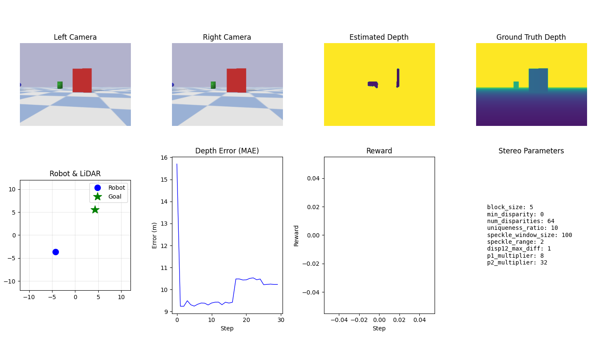

# CAM-Depth: Stereo Camera Depth Estimation for Robot Navigation

Replace expensive LiDAR sensors with cost-effective stereo cameras for robot navigation, using reinforcement learning to optimize depth estimation parameters.


## 🎯 Project Goal

Demonstrate that **stereo cameras can replace LiDAR** for robot navigation by:
1. Generating depth maps from stereo camera pairs
2. Using **reinforcement learning** to optimize stereo matching parameters
3. Comparing navigation performance between LiDAR and camera-based systems



## 🏗️ Architecture

```
CAM-Depth/
├── src/
│   ├── simulation/     # PyBullet world, robot, sensors
│   ├── depth/          # Stereo depth estimation (SGBM)
│   ├── navigation/     # LiDAR & camera-based navigation
│   ├── rl/             # Gymnasium env, rewards, training
│   └── visualization/  # Live display & metrics plotting
├── scripts/            # Entry point scripts
├── configs/            # YAML configuration
└── data/results/       # Training outputs
```

## 🚀 Quick Start

### Installation

```bash
cd G:\Robotic\CAM-Depth

# Create virtual environment (recommended)
python -m venv venv
.\venv\Scripts\activate  # Windows

# Install dependencies
pip install -r requirements.txt
```

### Run Demos

```bash
# LiDAR navigation baseline
python scripts/run_lidar_baseline.py --visualize

# Camera navigation with stereo depth
python scripts/run_camera_nav.py --visualize

# Train RL agent to optimize depth parameters
python scripts/train_depth_rl.py --epochs 100 --visualize

# Compare LiDAR vs Camera performance
python scripts/compare_methods.py --episodes 20
```

## 🔧 Configuration

Edit `configs/config.yaml` to customize:

```yaml
simulation:
  gui: true
  world_size: [20.0, 20.0]

robot:
  camera_baseline: 0.1  # Stereo camera separation

depth_estimation:
  # Initial parameters (RL will optimize these)
  block_size: 5
  num_disparities: 64
  uniqueness_ratio: 10

training:
  algorithm: "PPO"
  total_timesteps: 100000
```

## 📊 RL Depth Optimization

The RL agent learns to adjust stereo matching parameters:

| Parameter | Range | Description |
|-----------|-------|-------------|
| `block_size` | 3-21 (odd) | Matching window size |
| `num_disparities` | 16-128 | Search range for stereo matching |
| `uniqueness_ratio` | 0-20 | Filter ambiguous matches |
| `speckle_window_size` | 50-200 | Noise filtering window |

**Reward Function:**
- **Depth error** (MAE vs ground truth)
- **Coverage** (valid pixel ratio)
- **Accuracy** (% within 10% of ground truth)

## 📈 Expected Results

After training, the camera-based system should achieve:
- **Navigation success rate**: ~80-90% (vs LiDAR ~95%)
- **Depth estimation error**: <0.15m MAE
- **Cost savings**: ~90% compared to LiDAR

## 🛠️ Scripts Reference

| Script | Purpose |
|--------|---------|
| `train_depth_rl.py` | Train RL agent for depth optimization |
| `compare_methods.py` | Generate LiDAR vs Camera comparison |
| `run_lidar_baseline.py` | Demo LiDAR navigation |
| `run_camera_nav.py` | Demo camera-based navigation |

### Command Line Options

```bash
# Training options
python scripts/train_depth_rl.py \
    --epochs 100 \
    --timesteps 50000 \
    --algorithm PPO \
    --lr 0.0003 \
    --visualize \
    --save-dir data/results

# Comparison options  
python scripts/compare_methods.py \
    --episodes 20 \
    --max-steps 500 \
    --headless
```

## 📝 License

MIT License - see LICENSE file for details.
